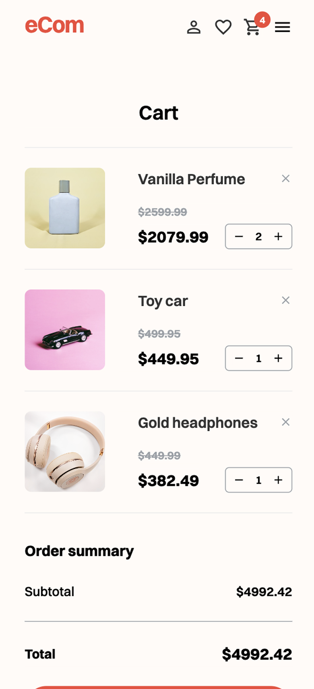

# eCom Store

## Overview

This is an e-commerce store built using React. The store allows users to browse products, view product details, add products to their cart, and complete a checkout process. Users can also contact the store via a contact form with validation.

## Live Demo

[Deployed Application](https://reactecom-project.netlify.app/)

## Technologies Used

- React
- React Router
- CSS Modules
- Fetch API for retrieving product data

## Features

- **Homepage**: Displays a list of products with a search bar for filtering.
- **Product Page**: Shows details of a single product, including title, description, price, discount, and reviews.
- **Shopping Cart**: Allows users to add, remove, and view items in their cart.
- **Checkout Process**: Users can proceed to checkout and view a success message upon completion.
- **Contact Page**: Contains a validated form for users to reach out.

## Highlights / Unique Implementations

- **Dynamic Discount Calculation**: Displays discounts when applicable.
- **React Router for Navigation**: Smooth transitions between pages.
- **LocalStorage Usage**: Cart data persists across sessions.
- **Custom Styling**: Responsive design with CSS Modules.

## Installation & Setup

1. Clone the repository:
   ```sh
   git clone https://github.com/H-chai/react-ecom.git
   ```
2. Navigate to the project folder:
   ```sh
   cd react-ecom
   ```
3. Install dependencies:
   ```sh
   npm install
   ```
4. Start the development server:
   ```sh
   npm run start
   ```
5. Open [http://localhost:3000](http://localhost:3000) in your browser.

## API

This project uses the [Noroff API](https://v2.api.noroff.dev/online-shop) to fetch product data.

- Retrieve all products:
  ```sh
  GET https://v2.api.noroff.dev/online-shop
  ```
- Retrieve a single product by ID:
  ```sh
  GET https://v2.api.noroff.dev/online-shop/{productId}
  ```

## Project Structure

```
/src
  ├── components
  │   ├── Header.js
  │   ├── Footer.js
  │   ├── NavLeft.js
  │   ├── NavMiddle.js
  │   └── Layout.js
  ├── hooks
  │   ├── useApi.js
  ├── pages
  │   ├── Home.js
  │   ├── Product.js
  │   ├── Cart.js
  │   ├── CheckoutSuccess.js
  │   └── Contact.js
  ├── store
  │   ├── cartStore.js
  ├── styles
  ├── App.js
  ├── index.js
/public
  ├── index.html
```

## Future Improvements

- Implement user authentication (JWT)
- Add payment gateway integration
- Improve UI/UX design (Dark mode, better accessibility)

## Screenshots

### Homepage

#### Desktop


#### Mobile


### Product Page

#### Desktop


#### Mobile


### Shopping Cart

#### Desktop


#### Mobile


